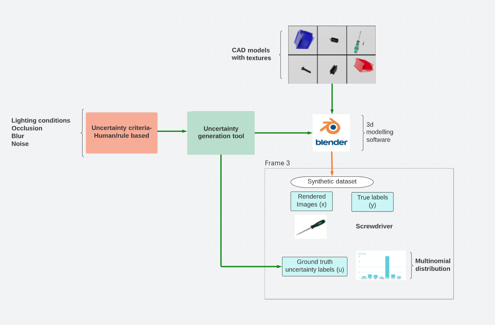
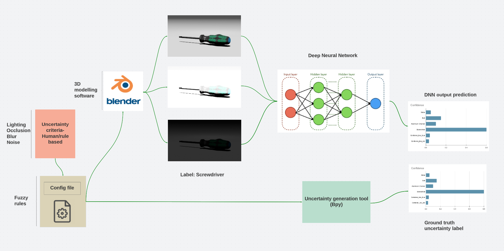

# Benchmarking Uncertainty Estimation of Deep Learning Models Using Synthetic Dataset

* In this project we create a platform for the deep learning researchers to test the DNN models for uncertainty using **ground truth uncertainty labels** and **synthetic datasets**.

* Deep neural networks are well known for their stochastic nature and they provide point estimates with no measure of uncertainty which leads to misclassifications and overconfident predictions.

* To address the need for understanding and explaining what a neural network doesn't know, research has provided the concept of uncertainty estimation in deep learning by which the confidence of the deep learning model can be determined.

* The quality of the uncertainty estimates mainly depends on the method used for estimating the uncertainty and assessing the quality of these uncertainty estimates is not straightforward,  as there are no direct uncertainty ground truth labels available for evaluation.

* Humans by default have the knowledge of uncertainty from their past experiences and they can distinguish between the uncertain conditions and normal conditions in different scenarios like lighting, occlusion, blur, etc.

* Form the natural language criteria of human uncertainty values will be generated in the form of multinomial distribution and these values will be mapped to the synthetic datasets generated in blender.

* Based on this approach, we create a platform for the researchers to test the uncertainty in deep learning models in different scenarios where the user/researchers can use the proposed platform to modify the conditions like lighting, blur, and occlusion by adjusting the respective parameters and can generate test images for different scenarios.
* By addressing the problem of ground truth uncertainty labels, we set a benchmark for the uncertainty in deep learning models using synthetic datasets.

## Problem statement

* To meet the human expectations deep learning models should be able to say about what they are uncertain about.

* The state-of-the-art uncertainty estimation techniques did not use any **uncertainty ground truth label** for evaluating the predictive uncertainty in the DNN model.
* To access the quality of uncertainty estimates ground-truth for uncertainty is not available.
* Defining ground truth for the evaluation of predictive uncertainty estimation has been one of the challenging problems in state-of-the-art Deep learning.

## Proposed approach

## Research questions

* Why is it difficult to define ground truth for uncertainty estimation?

* Which method can be used for determining the ground truth uncertainty labels?
    * How do we generate ground truth values from the rule based criteria?
    * How do we map the uncertainities to the synthetic data-sets?

* What are the requirements for generating uncertainty in different scenarios?
 * What should be the threshold region for the uncertainty in different scenarios?